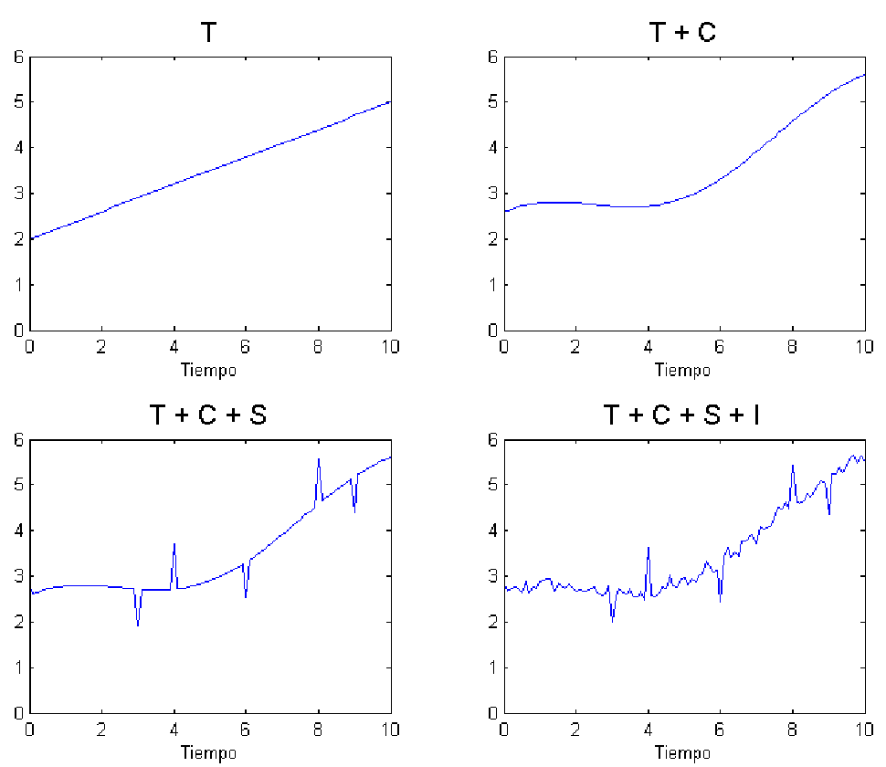
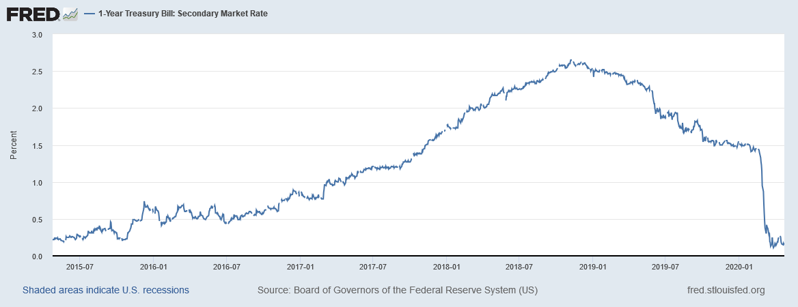
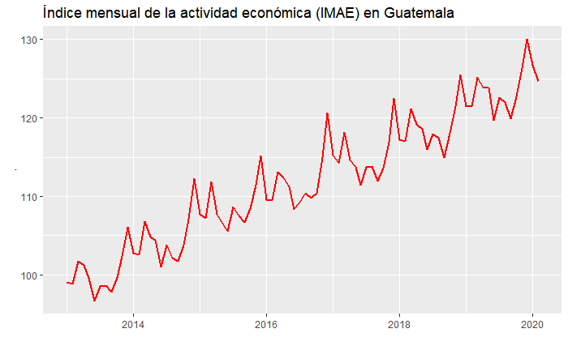

# ¿Para qué pronosticamos?

- En muchas situaciones, requerimos pronósticos para la **toma de decisiones**.

- Algunas cosas son más fáciles de pronosticar que otras:
  - ¿Qué tan bien conocemos los factores que influyen?
  - ¿Cuántos datos tenemos disponibles?
  - Si los pronósticos pueden afectar aquello que intentamos pronosticar.
  
- Los métodos de pronóstico intentan capturar la forma en que varían las cosas: **proceso generador de datos**.
  

----

- Debemos estar conscientes de las limitaciones: 50% - 50%

- Los métodos de pronóstico pueden variar por:
  - **tipos de patrones de datos**: tendencia, estacionalidad, volatilidad.
  - **complejidad**: desde el pronóstico ingenuo, promedios, suavizamiento exponencial hasta redes neuronales y sistemas econométricos (e.g modelos VAR).
  - la **cantidad de datos disponibles**: pronósticos de juicio


# Horizonte de pronóstico

- Dependiendo de la aplicación, **cada organización** o persona puede clasificar sus pronóstico como: 

  - de **corto plazo**: por ejemplo, calendarización de personal, producción, transportes, demanda de productos.

  - de **mediano plazo**: requerimientos de materiales, maquinaria.
  
  - de **largo plazo**: planeación estratégica, oportunidades de mercado.


# Métodos de pronóstico

- **Cualitativos**: cuando no hay información disponible o relevante para los pronósticos deseados.

- **Cuantitativos**: cuando existe información numérica del pasado y está disponible. Usualmente, los métodos **asumen** que los patrones pasados podrían seguirse dando en el futuro.

  - Series de tiempo: precios de acciones, índice de precios al consumidor, ventas trimestrales de una empresa, PIB anual. 
  
  
# Modelos de series de tiempo

- Resultan útiles para pronosticar series de tiempo, por ejemplo el **modelo explicativo**: 

$$\begin{eqnarray}
\text{Demanda eléctrica} = f(\text{temperatura}, \text{actividad económica}, \nonumber \\ 
\text{población}, \text{hora del día}, \nonumber \\ 
\text{día de la semana}, \text{error}) 
\end{eqnarray}$$

- Modelos de series de tiempo: 
$$ DE_{t+1} = f(DE_t, DE_{t-1}, DE_{t-2}, \ldots, \text{error})$$
  
- Algunos de estos modelos son: de descomposición, suavizamiento exponencial, modelos ARIMA.

- Preferencia de los modelos de series de tiempo.


# Metodología de pronóstico

- **Definición del problema**: ¿qué es lo que se quiere pronosticar?
- **Recolectar información**: estadística y experticia de las personas que obtienen los datos o utilizan los pronósticos.
- **Análisis exploratorio preliminar**: ¡debemos graficar los datos!
- **Elección y ajuste de modelos**: dependen de la disponibilidad y comportamiento de los datos y la forma en que se usarán los pronósticos.
- **Utilización y evaluación de los pronósticos**: evaluamos el desempeño de nuestros modelos utilizando diferentes métodos y métricas.


# Análisis exploratorio, ¿qué ver?

- Principalmente, observamos:
  - Tendencias
  - Estacionalidad
  - Volatilidad irregular

- Pero también es muy importante observar:
  - Estacionariedad (estabilidad)
  - Quiebres estructurales

Agregar ejemplo de estos conceptos con gráficas


## Descomposición de series de tiempo

- Podemos pensar que una serie de tiempo $y_t$ se descompone en partes:  
$$ y_t = (T_t + C_t) + S_t + R_t $$  

{width=55%}

## Bonos del tesoro

{width=100%}

## Acciones

{width=85%}


## Actividad económica de Guatemala

{width=85%}


# Técnicas de pronóstico por tipo de datos

- **Datos estacionarios**: métodos informales, métodos de promedio simple, promedio móvil, suavizamiento exponencial simple y módelos ARIMA.

- **Datos con tendencia**: promedios móviles, suavizamiento exponencial de Holt, modelos de curvas de crecimiento y modelos ARIMA.

- **Datos con estacionalidad**: métodos de extracción de señales (X-12 ARIMA, STL), suavizamiento exponencial de Holt-Winters y modelos ARIMA.


# Utilizando R

- Utilizamos el entorno de `tidyverse`:
<!-- para cargar los datos y hacer gráficas. -->
```{r carga_tidyverse}
library(tidyverse)
```

- Y `forecast` para aplicar algunos métodos de pronósticos:
```{r carga_forecast, results='hide'}
library(forecast)
```

# Carga de datos

- Podemos cargar datos con la función `read_csv`:
```{r carga_ipc, results='hide'}
ipc <- read_csv("data/IPC_Guatemala.csv");
```
- Obtenemos una **serie de tiempo** para pronosticar:
```{r get_ts_ipc}
frutas <- ts(ipc$`Frutas de estación`, 
             start = c(2010, 12), frequency = 12, 
             names = "Frutas de estación")
```


## Frutas de estación

```{r plot_ipc}
autoplot(frutas)
```

----

- Podemos analizar la estacionalidad con una gráfica
```{r frutas_ggseasonplot}
ggseasonplot(frutas, year.labels=TRUE, year.labels.left=TRUE) 
```


----
```{r load_imae, include=FALSE}
imae <- read_csv("data/IMAE.csv")
```


```{r plot_imae}
imae %>% 
  select(IMAE) %>% 
  ts(start = c(2013, 1), frequency = 12) %>% 
  autoplot(size=1, col="red") + 
    ggtitle("IMAE de Guatemala")
```


----

- Cargamos una serie en frecuencia trimestral `frequency = 4`: 
```{r load_pib, results='hide'}
pib <- read_csv("data/PIBGT_trimestral.csv")
pib_trim <- ts(pib$PIB, 
               start = c(2013, 1), frequency = 4, names = "PIB")
```

----

```{r plot_pib}
autoplot(pib_trim)
```


# Métodos de pronóstico base

- Veamos algunos métodos de pronósticos, que a pesar de ser simples, pueden ser muy efectivos en ocasiones.

  - Método de **promedio histórico**.
  - Método de **pronóstico ingenuo** (*naïve*)
  - Método de **tendencia**. 

- A veces, con estos métodos es suficiente, pero en general, sirven como referencia para asegurarnos que **métodos más sofisticados son mejores** que estas alternativas simples. 


## Promedio histórico

- Se pronostican todos los valores futuros utilizando la **media histórica** de las observaciones. Si denotamos los datos históricos por $y_{1},\dots,y_{T}$, este promedio sería:  
$$\hat{y}_{T+h|T} = \bar{y} = (y_{1}+\dots+y_{T})/T.$$

```{r}
meanf(frutas, h = 6)
```

---- 

```{r historical_mean_method}
frutas %>%
  meanf(h=6) %>%
  autoplot()
```


## Pronóstico "ingenuo"

- Es un método informal en el que fijamos los pronósticos en la última observación:  
$$\hat{y}_{T+h|T} = y_{T}.$$
```{r naive_method}
naive(frutas, h = 6)
```

----

```{r naive_method_plot}
frutas %>%
  naive(h=6) %>%
  autoplot()
```


## Ingenuo estacional

- Parecido al pronóstico ingenuo, pero fijamos cada período con el mismo valor observado del año pasado. Por ejemplo, febrero con febrero del año pasado.
$$ \hat{y}_{T+h|T} = y_{T+h-m(k+1)} $$
```{r seasonal_naive}
snaive(frutas, h=6)
```

----

```{r seasonal_naive_plot}
frutas %>%
  snaive(h=6) %>%
  autoplot()
```


## Método de tendencia

- Permitimos una tendencia o `drift` en el pronóstico para que varíe de acuerdo a la variación promedio observada en los datos.
$$\hat{y}_{T+h|T} = y_{T} + \frac{h}{T-1}\sum_{t=2}^T (y_{t}-y_{t-1}) = y_{T} + h \left( \frac{y_{T} -y_{1}}{T-1}\right).$$
```{r drift_method}
rwf(frutas, h = 6, drift = TRUE)
```

----

```{r drift_method_plot}
frutas %>%
  rwf(h=6, drift = TRUE) %>%
  autoplot()
```

----

```{r base_methods_comparison}
autoplot(frutas) +
  autolayer(meanf(frutas, h=12), series="Promedio", PI=FALSE) +
  autolayer(rwf(frutas, h=12), series="Naïve", PI=FALSE) +
  autolayer(rwf(frutas, drift=TRUE, h=12), 
            series="Tendencia", PI=FALSE) +
  ggtitle("Pronósticos de índices de precios de frutas en Guatemala")
```

<!-- ```{r boxcox_transform} -->
<!-- lambda <- BoxCox.lambda(frutas) -->
<!-- autoplot(BoxCox(frutas,lambda)) -->
<!-- ``` -->

<!-- # ```{r window_from_date} -->
<!-- # window(frutas, start=c(2015,6)) -->
<!-- # ``` -->
<!-- #  -->
<!-- # ```{r subset_by_months} -->
<!-- # subset(frutas, month = 12) -->
<!-- # ``` -->


# Suavizamiento exponencial

- Puede pensarse que es un punto medio entre el pronóstico ingenuo y el método de promedio: $$ \hat{y}_{T+1|T} = \alpha y_T + \alpha(1-\alpha) y_{T-1} + \alpha(1-\alpha)^2 y_{T-2}+ \cdots$$

- Si lo escribimos de forma recursiva, tenemos: $$ \hat{y}_{T+1|t} = \alpha y_T + (1-\alpha) \hat{y}_{T|T-1} $$

- $\alpha$ es el parámetro de suavizamiento.

- Muy útil cuando los datos no tienen una tendencia clara o un patrón estacional.

----

- Para obtener el pronóstico, utilizamos la función `ses`
```{r single_exp_smoothing}
ses(frutas, h=6)
```

---- 

- Tiene un valor de pronóstico constante

```{r single_exp_smoothing_plot}
  ses(frutas, h = 6) %>%
  autoplot()
```

---- 

- El valor de pronóstico constante puede parecer **trivial**, pero cuando la serie de tiempo es **estacionaria**, es de hecho el pronóstico óptimo$^*$. 

<!-- - Consideremos si vemos el último año de la serie de precios. -->

```{r single_exp_smoothing_plot_zoom}
frutas %>% window(start = 2019) %>%  ses(h = 6 ) %>% autoplot()
```


<!-- # ```{r} -->
<!-- # fc <- ses(frutas, h = 6) -->
<!-- # autoplot(fc) + -->
<!-- #   autolayer(fitted(fc), series="Ajustados") -->
<!-- # ``` -->

# Método de tendencia de Holt

- Holt (1957) extendió el método de suavizamiento exponencial para pronosticar datos con tendencia. 

- Involucra una **ecuación de pronóstico** y dos **ecuaciones de suavizamiento**: 
$$ \begin{align*}
  \text{Pronóstico}&& \hat{y}_{t+h|t} &= \ell_{t} + hb_{t} \\
  \text{Nivel}   && \ell_{t} &= \alpha y_{t} + (1 - \alpha)(\ell_{t-1} + b_{t-1})\\
  \text{Tendencia}   && b_{t}    &= \beta^*(\ell_{t} - \ell_{t-1}) + (1 -\beta^*)b_{t-1},
\end{align*}$$

- Los pronósticos dependen del último nivel estimado y $h$ veces el último valor estimado de la tendencia.

---- 

```{r holt_method}
holt(frutas, h = 6)
```

---- 

```{r holt_method_plot}
frutas %>% 
  holt(h = 6) %>% 
  autoplot()
```

## Suavización

- El método de Holt provee pronósticos con una tendencia constante.

- Usualmente, esto tiende a **sobreestimar** para pronósticos más largos.

- Una forma de mitigar esto es con un parámetro $\phi$ de suavizamiento (Gardner y McKenzie 1985)

$$\begin{align*}
  \hat{y}_{t+h|t} &= \ell_{t} + (\phi+\phi^2 + \dots + \phi^{h})b_{t} \\
  \ell_{t} &= \alpha y_{t} + (1 - \alpha)(\ell_{t-1} + \phi b_{t-1})\\
  b_{t} &= \beta^*(\ell_{t} - \ell_{t-1}) + (1 -\beta^*)\phi b_{t-1}.
\end{align*}$$

---- 

```{r holt_damped_comparison}
h1 <- holt(frutas, h = 6)
h2 <- holt(frutas, h = 6, damped = TRUE, phi = 0.9)
autoplot(frutas) +
  autolayer(h1, series="Método de Holt", PI=FALSE) +
  autolayer(h2, series="Holt suavizado", PI=FALSE)
```


# Método estacional de Holt-Winters

- Holt y Winters extendieron el método original de Holt para capturar estacionalidad.

- Involucra una **ecuación de pronóstico** y tres **ecuaciones de suavizamiento**.

- Existe una versión **multiplicativa** y una versión **aditiva**.

  - Estacionalidad aumenta con el nivel $\Rightarrow$ multiplicativo.
  
  - Estacionalidad "independiente" $\Rightarrow$ aditivo.
  
## Versión aditiva 

$$ \begin{align*}
  \text{Pronóstico}&& \hat{y}_{t+h|t} &= \ell_{t} + hb_{t} + s_{t+h-m(k+1)} \\ 
  \text{Nivel}   && \ell_{t} &= \alpha(y_{t} - s_{t-m}) + (1 - \alpha)(\ell_{t-1} + b_{t-1})\\
  \text{Tendencia}   && b_{t} &= \beta^*(\ell_{t} - \ell_{t-1}) + (1 - \beta^*)b_{t-1}\\ 
  \text{Estación} && s_{t} &= \gamma (y_{t}-\ell_{t-1}-b_{t-1}) + (1-\gamma)s_{t-m}
\end{align*}$$

```{r hw_season_add}
hw(frutas, seasonal="additive", h = 6)
```

## Versión multiplicativa 

$$\begin{align*}
  \hat{y}_{t+h|t} &= (\ell_{t} + hb_{t})s_{t+h-m(k+1)} \\
  \ell_{t} &= \alpha \frac{y_{t}}{s_{t-m}} + (1 - \alpha)(\ell_{t-1} + b_{t-1})\\
  b_{t} &= \beta^*(\ell_{t}-\ell_{t-1}) + (1 - \beta^*)b_{t-1}                \\
  s_{t} &= \gamma \frac{y_{t}}{(\ell_{t-1} + b_{t-1})} + (1 - \gamma)s_{t-m}
\end{align*}$$

```{r hw_season_mult}
hw(frutas, seasonal = "multiplicative", h = 6)
```

---- 

```{r hw_season_comparison}
fit1 <- hw(frutas, seasonal="additive", h = 6)
fit2 <- hw(frutas, seasonal="multiplicative", h = 6)
autoplot(frutas) +
  autolayer(fit1, series="HW aditivo", PI=FALSE) +
  autolayer(fit2, series="HW multiplicativo", PI=FALSE) + 
  ggtitle("Comparación entre estacionalidad aditiva y multiplicativa")
```

---- 

```{r load_saws, include=FALSE}
saws <- read_csv("data/Saws.csv")
saws <- ts(saws, start = 2000, frequency = 4)
saws
```


```{r hw_season_comparison_saws}
fit1 <- hw(saws, seasonal="additive", h = 6)
fit2 <- hw(saws, seasonal="multiplicative", h = 6)
autoplot(saws) +
  autolayer(fit1, series="HW aditivo", PI=FALSE) +
  autolayer(fit2, series="HW multiplicativo", PI=FALSE) + 
  ggtitle("Comparación entre estacionalidad aditiva y multiplicativa")
```

# Métodología Box-Jenkins y modelos ARIMA
 
  - **Métodología Box-Jenkins**: identificación de modelos ARIMA para una serie de tiempo.
      - Proceso iterativo.
      - `forecast` provee funciones de ajuste automático.
      
  - "... en esencia, todos los modelos están equivocados, pero algunos son útiles ..."
  
      - Modelos autorregresivos (AR)
      - Integrados (I)
      - de medias móviles (MA)
  


## 1. Ajuste de estacionalidad

```{r season_adjust}
frutas %>% stl(s.window='periodic') %>% seasadj() -> frutas_adj
autoplot(frutas_adj)
```

## 2. Análisis de estructura con ACF y PACF

```{r structure_analysis}
frutas_adj %>% diff() %>% ggtsdisplay()
```

## 3. Especificación de modelo

```{r model_spec_auto_arima}
arima.model <- auto.arima(frutas_adj)
forecast(arima.model, h = 6)
```

## 4. Análisis de residuos

```{r residuals_check}
checkresiduals(arima.model)
```

## 5. Utilización del modelo

```{r arima_model_use}
autoplot(frutas) +
  autolayer(forecast(arima.model, h = 6), series= "Modelo ARIMA")
```

<!-- # ```{r} -->
<!-- # # Transformación posible para el modelo ARIMA -->
<!-- # diff(log(frutas)) %>% ggtsdisplay() -->
<!-- ``` -->

<!-- ```{r} -->
<!-- autoplot(log(frutas)) -->
<!-- ``` -->

# Evaluación de pronósticos

- Reservamos dos partes de la muestra: **entrenamiento** y **prueba**

- Calculamos los errores de pronóstico: $$ e_{T+h} = y_{T+h} - \hat{y}_{T+h|T} $$, donde los datos de entrenamiento son $\{y_1,\dots,y_T\}$ y los datos de prueba $\{y_{T+1},y_{T+2},\dots\}$. 

- Obtenemos **métricas** sobre el conjunto de errores de pronóstico. El modelo que minimice estas mediciones es el "ganador".

- Se puede esperar que una buena técnica de pronóstico produzca errores pequeños consistentemente.


## Métricas de evaluación

- Precisión: ¿qué tanto nos equivocamos?
$$
\begin{align*}
  \text{Mean absolute error: MAE} & = \text{promedio}(|e_{t}|),\\
  \text{Root mean squared error: RMSE} & = \sqrt{\text{promedio}(e_{t}^2)}.
\end{align*}$$

- Sesgo: ¿subestimamos o sobreestimamos?
$$
\begin{align*}
  \text{Mean error: ME} & = \text{promedio}(e_{t}), \\
  \text{Mean percentage error: MPE} & = \text{promedio}\left(\frac{y_{T+h} - \hat{y}_{T+h|T}}{\hat{y}_{T+h|T}} \right).
\end{align*}$$


----

- Obtenemos el conjunto de datos de identificación y ajuste (entrenamiento).

```{r plot_train_test}
saws_train <- window(saws, start=2000, end=c(2005,4))
autoplot(saws) + 
  autolayer(saws_train, series="Entrenamiento")
```

---- 

```{r plot_base_models_forecast}
sawsfit1 <- meanf(saws_train, h=4)
sawsfit2 <- rwf(saws_train, h=4)
sawsfit3 <- snaive(saws_train, h=4)
autoplot(saws) +
  autolayer(sawsfit1, series="Promedio", PI=FALSE) +
  autolayer(sawsfit2, series="Ingenuo", PI=FALSE) +
  autolayer(sawsfit3, series="Estacional", PI=FALSE) + 
  ggtitle("Pronósticos para ventas trimestrales de sierras")
```

----

- Obtenemos el conjunto de prueba: 

```{r split_test_data}
saws_test <- window(saws, start = 2006)
```

- Computamos las métricas:
```{r full_accuracy_metrics}
accuracy(sawsfit1, saws_test)
```


## Comparación de métricas

<!-- Comparación de métricas -->

```{r general_mean_forecast_metrics}
metricas <- c("MAE", "RMSE", "ME", "MPE")
accuracy(sawsfit1, saws_test)["Test set", metricas]
```

```{r random_walk_forecast_metrics}
accuracy(sawsfit2, saws_test)["Test set", metricas]
```

```{r snaive_forecast_metrics}
accuracy(sawsfit3, saws_test)["Test set", metricas]
```


## Modelo ¿multiplicativo o aditivo?

```{r hw_add_mult_comparison}
hw.add <- hw(saws_train, seasonal="additive", h = 4)
hw.mult <- hw(saws_train, seasonal="multiplicative", h = 4)
autoplot(saws) +
  autolayer(hw.add, series="HW aditivo", PI=FALSE) +
  autolayer(hw.mult, series="HW multiplicativo", PI=FALSE) +
  ggtitle("Pronósticos para ventas trimestrales de sierras con HW")
```

## Comparación de métricas

```{r hw_add_accuracy}
accuracy(hw.add, saws_test)[, metricas]
```

```{r hw_mult_accuracy}
accuracy(hw.mult, saws_test)[, metricas]
```


# Conclusiones

- Existen diferentes técnicas cuantitativas para pronosticar: 
  - Pronosticar es una **disciplina** y un **arte** 
  <!-- - [Instituto Internacional de Pronosticadores](https://forecasters.org/) -->
  - [Competencia M4](https://forecasters.org/resources/time-series-data/m4-competition/), ¡100,000 series y muchos métodos de pronóstico!
  - Algoritmos de aprendizaje automático (*machine learning*)
  
- Existen diferentes métricas y procedimientos de validación
  - Validación cruzada para series de tiempo.

- R es una herramienta fantástica análisis de datos y pronósticos
  - `tidyverse`.
  - muchos otros paquetes para la aplicación que se te ocurra.
  


# Referencias y material adicional

- Hanke, J. E., & Wichern, D. W. (2009). Pronósticos en los negocios 9a. Edición.

- Hyndman, R.J., & Athanasopoulos, G. (2018) Forecasting: principles and practice, 2nd edition, OTexts: Melbourne, Australia. OTexts.com/fpp2. Consultado en abril de 2020.

  - [Forecasting: Principles and Practice](https://otexts.com/fpp2/)

- Repositorio de la presentación y el código:
  - [https://github.com/rafaelchp/PronosticosSimplesR](https://github.com/rafaelchp/PronosticosSimplesR)