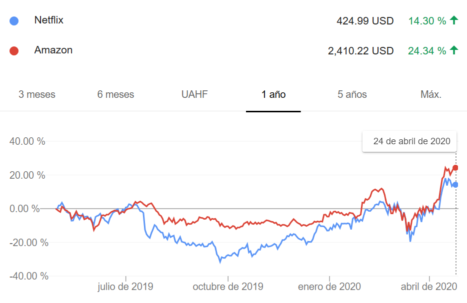

# ¿Para qué pronosticamos?

- En muchas situaciones, requerimos pronósticos para la **toma de decisiones**.

- Algunas cosas son más fáciles de pronosticar que otras:
  - ¿Qué tan bien conocemos los factores que influyen?
  - ¿Cuántos datos tenemos disponibles?
  - Si los pronósticos pueden afectar aquello que intentamos pronosticar.
  
- Los métodos de pronóstico intentan capturar la forma en que varían las cosas: **proceso generador de datos**.
  

----

- Debemos estar conscientes de las limitaciones: 50% - 50%

- Los métodos de pronóstico pueden variar por:
  - **tipos de patrones de datos**: tendencia, estacionalidad, volatilidad.
  - **complejidad**: desde el pronóstico ingenuo, promedios, suavizamiento exponencial hasta redes neuronales y sistemas econométricos (e.g modelos VAR).
  - la **cantidad de datos disponibles**: pronósticos de juicio


# Horizonte de pronóstico

- Dependiendo de la aplicación, **cada organización** o persona puede clasificar sus pronóstico como: 

  - de **corto plazo**: por ejemplo, calendarización de personal, producción, transportes, demanda de productos.

  - de **mediano plazo**: requerimientos de materiales, maquinaria.
  
  - de **largo plazo**: planeación estratégica, oportunidades de mercado.


# Métodos de pronóstico

- **Cualitativos**: cuando no hay información disponible o relevante para los pronósticos deseados.

- **Cuantitativos**: cuando existe información numérica del pasado y está disponible. Usualmente, los métodos **asumen** que los patrones pasados podrían seguirse dando en el futuro.

  - Series de tiempo: precios de acciones, índice de precios al consumidor, ventas trimestrales de una empresa, PIB anual. 
  
  
# Modelos de series de tiempo

- Resultan útiles para pronosticar series de tiempo, por ejemplo el **modelo explicativo**: 

$$\begin{eqnarray}
\text{Demanda eléctrica} = f(\text{temperatura}, \text{actividad económica}, \nonumber \\ 
\text{población}, \text{hora del día}, \nonumber \\ 
\text{día de la semana}, \text{error}) 
\end{eqnarray}$$

- Modelos de series de tiempo: 
$$ DE_{t+1} = f(DE_t, DE_{t-1}, DE_{t-2}, \ldots, \text{error})$$
  
- Algunos de estos modelos son: de descomposición, suavizamiento exponencial, modelos ARIMA.

- Preferencia de los modelos de series de tiempo.


# Metodología de pronósitco

- **Definición del problema**: ¿qué es lo que se quiere pronosticar?
- **Recolectar información**: estadística y experticia de las personas que obtienen los datos o utilizan los pronósticos.
- **Análisis exploratorio preliminar**: ¡debemos graficar los datos!
- **Elección y ajuste de modelos**: dependen de la disponibilidad y comportamiento de los datos y la forma en que se usarán los pronósticos.
- **Utilización y evaluación de los pronósticos**: evaluamos el desempeño de nuestros modelos utilizando diferentes métodos y métricas.


# Análisis exploratorio, ¿qué ver?

- Principalmente, observamos:
  - Tendencias
  - Estacionalidad
  - Volatilidad irregular

- Pero también es muy importante observar:
  - Estacionariedad (estabilidad)
  - Quiebres estructurales

Agregar ejemplo de estos conceptos con gráficas


## Descomposición de series de tiempo

- Podemos pensar que una serie de tiempo $y_t$ se descompone en partes:  
$$ y_t = (T_t + C_t) + S_t + R_t $$  

{width=55%}

## Bonos del tesoro

{width=100%}

## Acciones

{width=85%}


## Actividad económica de Guatemala

{width=85%}


# Técnicas de pronóstico por tipo de datos

- **Datos estacionarios**: métodos informales, métodos de promedio simple, promedio móvil, suavizamiento exponencial simple y módelos ARIMA.

- **Datos con tendencia**: promedios móviles, suavizamiento exponencial de Holt, modelos de curvas de crecimiento y modelos ARIMA.

- **Datos con estacionalidad**: métodos de extracción de señales (X-12 ARIMA, STL), suavizamiento exponencial de Holt-Winters y modelos ARIMA.


# Utilizando R

- Utilizamos el entorno de `tidyverse`:
<!-- para cargar los datos y hacer gráficas. -->
```{r carga_tidyverse}
library(tidyverse)
```

- Y `forecast` para aplicar algunos métodos de pronósticos:
```{r carga_forecast, results='hide'}
library(forecast)
```

# Carga de datos

- Podemos cargar datos con la función `read_csv`:
```{r carga_ipc, results='hide'}
ipc <- read_csv("data/IPC_Guatemala.csv");
```
- Obtenemos una **serie de tiempo** para pronosticar:
```{r get_ts_ipc}
frutas <- ts(ipc$`Frutas de estación`, 
             start = c(2010, 12), frequency = 12, 
             names = "Frutas de estación")
```


## Frutas de estación

```{r plot_ipc}
autoplot(frutas)
```

----

- Podemos analizar la estacionalidad con una gráfica
```{r frutas_ggseasonplot}
ggseasonplot(frutas, year.labels=TRUE, year.labels.left=TRUE) 
```


----
```{r load_imae, include=FALSE}
imae <- read_csv("data/IMAE.csv")
```


```{r plot_imae}
imae %>% 
  select(IMAE) %>% 
  ts(start = c(2013, 1), frequency = 12) %>% 
  autoplot(size=1, col="red") + 
    ggtitle("IMAE de Guatemala")
```


----

- Cargamos una serie en frecuencia trimestral `frequency = 4`: 
```{r load_pib, results='hide'}
pib <- read_csv("data/PIBGT_trimestral.csv")
pib_trim <- ts(pib$PIB, 
               start = c(2013, 1), frequency = 4, names = "PIB")
```

----

```{r plot_pib}
autoplot(pib_trim)
```


# Métodos de pronóstico

- Veamos algunos métodos de pronósticos, que a pesar de ser simples, pueden ser muy efectivos en ocasiones.


## Promedio histórico

- Se pronostican todos los valores futuros utilizando la **media histórica** de las observaciones. Si denotamos los datos históricos por $y_{1},\dots,y_{T}$, este promedio sería:  
$$\hat{y}_{T+h|T} = \bar{y} = (y_{1}+\dots+y_{T})/T.$$

```{r}
meanf(frutas, h = 6)
```

---- 

```{r historical_mean_method}
frutas %>%
  meanf(h=6) %>%
  autoplot()
```


## Pronóstico "ingenuo"

- Es un método informal en el que fijamos los pronósticos en la última observación:  
$$\hat{y}_{T+h|T} = y_{T}.$$ 
```{r naive_method}
naive(frutas, h = 6)
```

----

```{r naive_method_plot}
frutas %>%
  naive(h=6) %>%
  autoplot()
```


## Ingenuo estacional

- Parecido al pronóstico ingenuo, pero fijamos cada período con el mismo valor observado del año pasado. Por ejemplo, febrero con febrero del año pasado.
$$ \hat{y}_{T+h|T} = y_{T+h-m(k+1)} $$
```{r seasonal_naive}
snaive(frutas, h=6)
```

----

```{r seasonal_naive_plot}
frutas %>%
  snaive(h=6) %>%
  autoplot()
```


## Método de tendencia

- Permitimos una tendencia o `drift` en el pronóstico para que varíe de acuerdo a la variación promedio observada en los datos.
$$\hat{y}_{T+h|T} = y_{T} + \frac{h}{T-1}\sum_{t=2}^T (y_{t}-y_{t-1}) = y_{T} + h \left( \frac{y_{T} -y_{1}}{T-1}\right).$$
```{r drift_method}
rwf(frutas, h = 6, drift = TRUE)
```

----

```{r drift_method_plot}
frutas %>%
  rwf(h=6, drift = TRUE) %>%
  autoplot()
```

----

```{r base_methods_comparison}
autoplot(frutas) +
  autolayer(meanf(frutas, h=12),
    series="Promedio", PI=FALSE) +
  autolayer(rwf(frutas, h=12),
    series="Naïve (ingenuo)", PI=FALSE) +
  autolayer(rwf(frutas, drift=TRUE, h=12),
    series="Tendencia", PI=FALSE) +
  ggtitle("Pronósticos de precios del frutas en Guatemala")
```

<!-- ```{r boxcox_transform} -->
<!-- lambda <- BoxCox.lambda(frutas) -->
<!-- autoplot(BoxCox(frutas,lambda)) -->
<!-- ``` -->

<!-- # ```{r window_from_date} -->
<!-- # window(frutas, start=c(2015,6)) -->
<!-- # ``` -->
<!-- #  -->
<!-- # ```{r subset_by_months} -->
<!-- # subset(frutas, month = 12) -->
<!-- # ``` -->


# Suavizamiento exponencial

- Puede pensarse que es un punto medio entre el pronóstico ingenuo y el método de promedio: $$ \hat{y}_{T+1|T} = \alpha y_T + \alpha(1-\alpha) y_{T-1} + \alpha(1-\alpha)^2 y_{T-2}+ \cdots$$

- Si lo escribimos de forma recursiva, tenemos: $$ \hat{y}_{T+1|t} = \alpha y_T + (1-\alpha) \hat{y}_{T|T-1} $$

- $\alpha$ es el parámetro de suavizamiento.

- Muy útil cuando los datos no tienen una tendencia clara o un patrón estacional.

----

- Para obtener el pronóstico, utilizamos la función `ses`
```{r single_exp_smoothing}
ses(frutas, h=6)
```

---- 

- Tiene un valor de pronóstico constante

```{r single_exp_smoothing_plot}
  ses(frutas, h = 6) %>%
  autoplot()
```


<!-- ```{r} -->
<!-- fc <- ses(frutas, h = 6) -->
<!-- autoplot(fc) + -->
<!--   autolayer(fitted(fc), series="Ajustados")  -->
<!-- ``` -->

<!-- ```{r} -->
<!-- fc <- holt(frutas, h=6) -->
<!-- autoplot(fc) + -->
<!--   autolayer(fitted(fc), series="Ajustados")  -->
<!-- ``` -->

<!-- ```{r} -->
<!-- fc <- holt(frutas, h = 6) -->
<!-- fc2 <- holt(frutas, h = 6, damped = TRUE, phi = 0.9) -->
<!-- autoplot(frutas) + -->
<!--   autolayer(fc, series="Método de Holt", PI=FALSE) + -->
<!--   autolayer(fc2, series="Holt suavizado", PI=FALSE) -->
<!-- ``` -->

<!-- ```{r} -->
<!-- fit1 <- hw(frutas, seasonal="additive", h = 6) -->
<!-- fit2 <- hw(frutas, seasonal="multiplicative", h = 6, damped = TRUE, phi = 0.95) -->
<!-- autoplot(frutas) + -->
<!--   autolayer(fit1, series="HW additive forecasts", PI=FALSE) + -->
<!--   autolayer(fit2, series="HW multiplicative forecasts", PI=FALSE) -->
<!-- ``` -->


<!-- ```{r} -->
<!-- frutas %>% stl(s.window='periodic') %>% seasadj() -> frutas_adj -->
<!-- autoplot(frutas_adj) -->
<!-- ``` -->

<!-- ```{r} -->
<!-- frutas_adj %>% diff() %>% ggtsdisplay() -->
<!-- ``` -->

<!-- ```{r} -->
<!-- arima.model <- auto.arima(frutas_adj) -->
<!-- forecast(arima.model, h = 6) -->
<!-- ``` -->

<!-- ```{r} -->
<!-- autoplot(frutas) +  -->
<!--   autolayer(forecast(arima.model), series= "Modelo ARIMA") -->
<!-- ``` -->

<!-- ```{r} -->
<!-- checkresiduals(arima.model) -->
<!-- ``` -->

<!-- ```{r} -->
<!-- diff(log(frutas)) %>% ggtsdisplay() -->
<!-- ``` -->

<!-- ```{r} -->
<!-- autoplot(log(frutas)) -->
<!-- ``` -->

